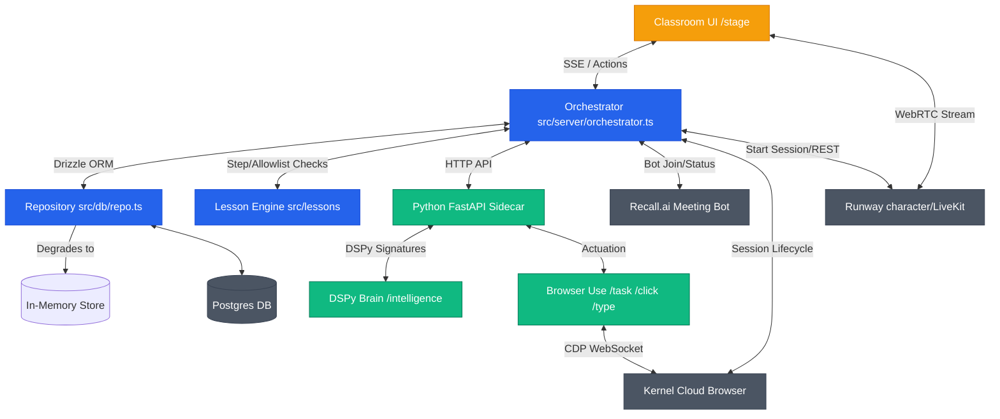
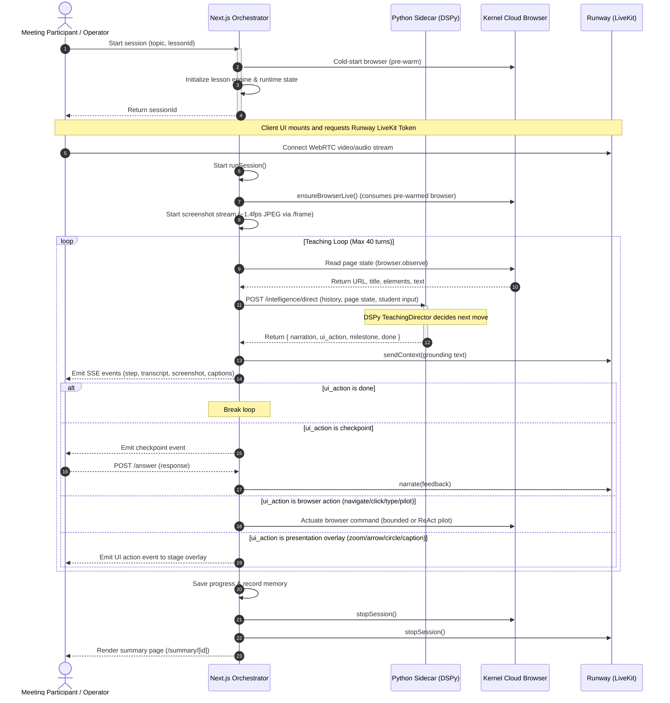

# ShareTeacher System Overview & Developer Context

This document serves as the developer's memory and system context for the **ShareTeacher** project. It outlines the architecture, backend, workflows, current development status, and areas for verification/fix.

---

## 1. System Architecture

ShareTeacher is a **Runway-first AI meeting teacher** that can join virtual meetings (Zoom, Google Meet, Teams), speak as a Runway Character, share a real browser viewport, and teach AI workflows (such as creating a PPT with ChatGPT) step-by-step.

The codebase is organized as follows:

| Component | Directory | Description |
|---|---|---|
| **Core Contracts** | `src/types/contracts.ts` | The single source of truth defining all organ APIs, stage events, tool shapes, and environment contracts. |
| **Orchestrator** | `src/server/` | Manages session state, tool execution, SSE publishers, and handles fallback paths. |
| **Integrations** | `src/integrations/` | Connectors for external systems: `runway`, `recall`, `kernel`, and `browser` (proxies to the python sidecar). |
| **Lesson Engine** | `src/lessons/` | Houses the curriculum, step structures, checkpoints, and domain allowlists. |
| **Persistence** | `src/db/` | Drizzle schema and Postgres repository (resiliently degrades to an in-memory database). |
| **Python Sidecar** | `browser_agent/` | FastAPI service running `browser-use` and the DSPy intelligence router. |
| **Classroom UI** | `src/app/` | Next.js layout, homepage, stage view (`/stage`), and summary view. |

---

## 2. The Backend

The backend is hybrid, consisting of:
1. **Next.js 15 Application**:
   - Acts as the primary orchestrator (`src/server/orchestrator.ts`).
   - Serves the classroom UI, streams live updates via **Server-Sent Events (SSE)**, and provides APIs for user actions (takeover, answer checkpoint).
   - Utilizes **Drizzle ORM** communicating with a Postgres database (with seamless in-memory fallback).
2. **Python FastAPI Sidecar (`browser_agent/`)**:
   - Lightweight service that controls `browser-use` (CDP-only, version `0.13.x`) and the **DSPy** intelligence layer.
   - Attaches directly to the remote Kernel cloud browser over its CDP WebSocket.
   - Runs the ReAct-based `BrowserPilot` for open-ended tasks and a `TeachingDirector` that drives the turn-by-turn class workflow.

---

## 3. The Orchestration Workflow

ShareTeacher runs in a **Director-Driven** loop rather than a rigid step-by-step script. The execution flow is:

### Detailed Flow Steps
1. **Pre-warm & Initialization**: When a session is created, the orchestrator begins cold-starting a Kernel browser in the background (~12s overhead) to hide latency from the user.
2. **Client-Side Runway Setup**: GWM-1 (Runway avatar) runs client-side. The client's browser negotiates the LiveKit credentials to render the character tile. The backend loop does not spawn a second Runway session.
3. **Turn-by-Turn Loop**:
   - The Orchestrator calls `browser.observe()` to obtain the URL, title, page text, and interactive elements.
   - This context is sent to the Python sidecar's `/intelligence/direct` route.
   - **DSPy TeachingDirector** analyzes the curriculum milestones, screen contents, history, and any recent student comments. It generates:
     - `narration`: The teacher's spoken output.
     - `ui_action`: The exact action to perform (e.g. `navigate`, `click`, `type`, `pilot`, `checkpoint`, `artifact`, etc.).
   - The orchestrator executes the action and updates the timeline.
   - If the sidecar is unreachable on the first turn, the orchestrator falls back to the lesson's fixed deterministic steps (`runLegacyLessonLoop`) so class still happens.

---

## 4. Current Status

### What is Built & Working:
* **Contracts (`src/types/contracts.ts`)**: Rigorous, single source of truth for types and tool schemas.
* **Orchestrator (`src/server/orchestrator.ts`)**: Integrates the state machines, SSE notifications, and execution fallback channels.
* **Database Degradation (`src/db/repo.ts`)**: The DB health ping degrades transparently to in-memory mode if Postgres is unavailable, making local development painless.
* **FastAPI Sidecar (`browser_agent/main.py`)**: CDP connection handling, async handle locks, and `/frame` lock-free screenshot streaming.
* **DSPy Intelligence Layer (`browser_agent/intelligence/`)**: Structuring screen interpreter, prompt composer, and director turns with signatures.
* **Verification Script (`qa/verify-realtime.ts`)**: Standalone verification that creates a Kernel cloud browser and starts/stops a Runway session without needing a microphone or user login.

### Prerequisites to Verify:
To run the live system, you need to configure the following credentials in `.env.local`:
* `OPENAI_API_KEY`: Required for DSPy brain, screen interpreter, and `browser-use` actions.
* `KERNEL_API_KEY`: Required to spin up cloud Chromium instances.
* `RUNWAY_API_KEY` & `RUNWAY_CHARACTER_ID`: Required for WebRTC avatar integration.
* `RECALL_API_KEY` (Optional): Required if joining Zoom/Google Meet.
* `DATABASE_URL` (Optional): Local PostgreSQL (port 5433 via `docker compose up -d postgres`).

---

## 5. Next Steps & Development Focus Areas

As we proceed, here are key items to test, verify, and resolve:
1. **CDP Elements Extraction Bug**: Let's ensure that the element extractor in `browser_agent/main.py` and `browser_agent/intelligence/programs.py` is extracting DOM selectors correctly in the `0.13.x` version of `browser-use`, specifically reading from `state.dom_state.selector_map` instead of `state.selector_map` (which returned `{}` in older versions).
2. **ChatGPT Login State Persistence**: Kernel persistent profile checks need verification. The same profile name (`KERNEL_PROFILE_NAME`) must be reused across browser sessions so that once a user completes a manual login via the Kernel live view, the cookies/session remain active for subsequent lessons.
3. **Vision Support**: Add vision capabilities (sending the base64 screenshot to the `ScreenInterpreter`) once vision models are enabled in the sidecar constraints.
4. **Director Turn Validation**: Confirm that direct actions chosen by the director are correctly clamped to the allowlist (e.g. not navigating outside `chatgpt.com` or `openai.com`).

---
*(Use this overview as a persistent reference during development changes.)*
